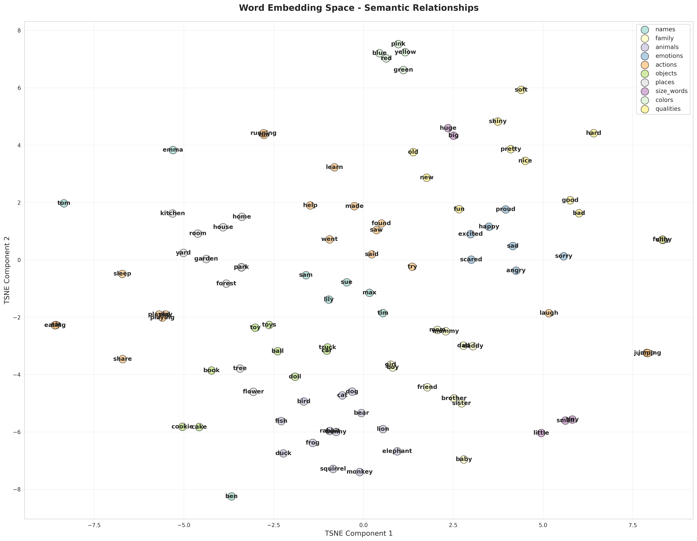
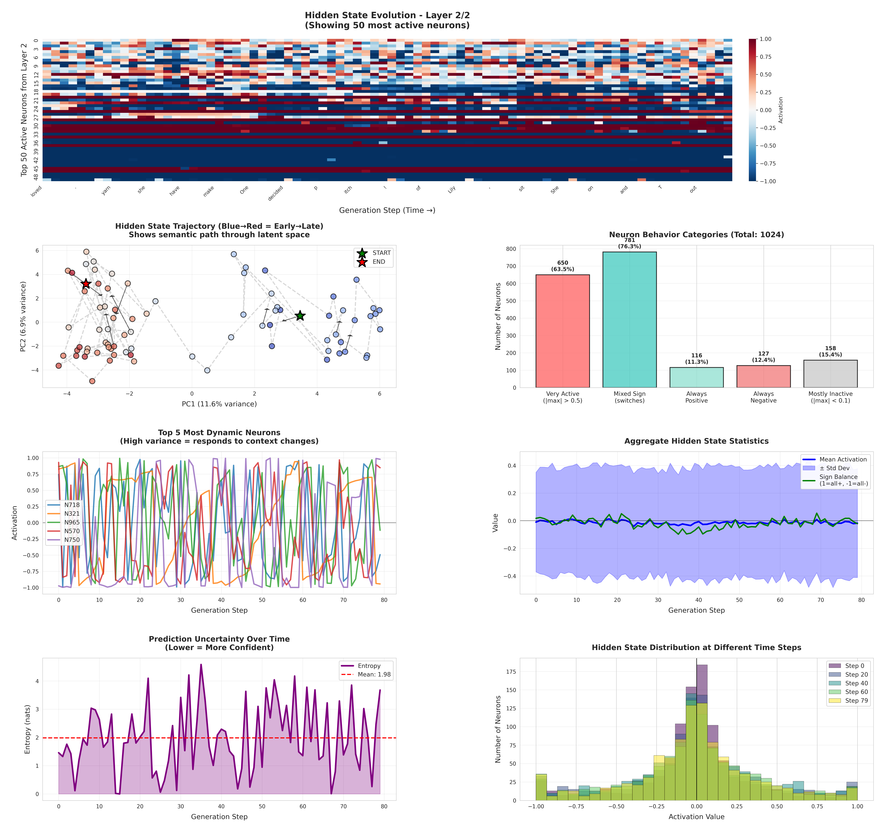
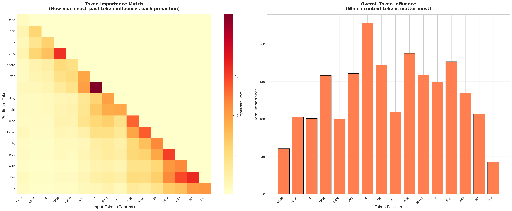
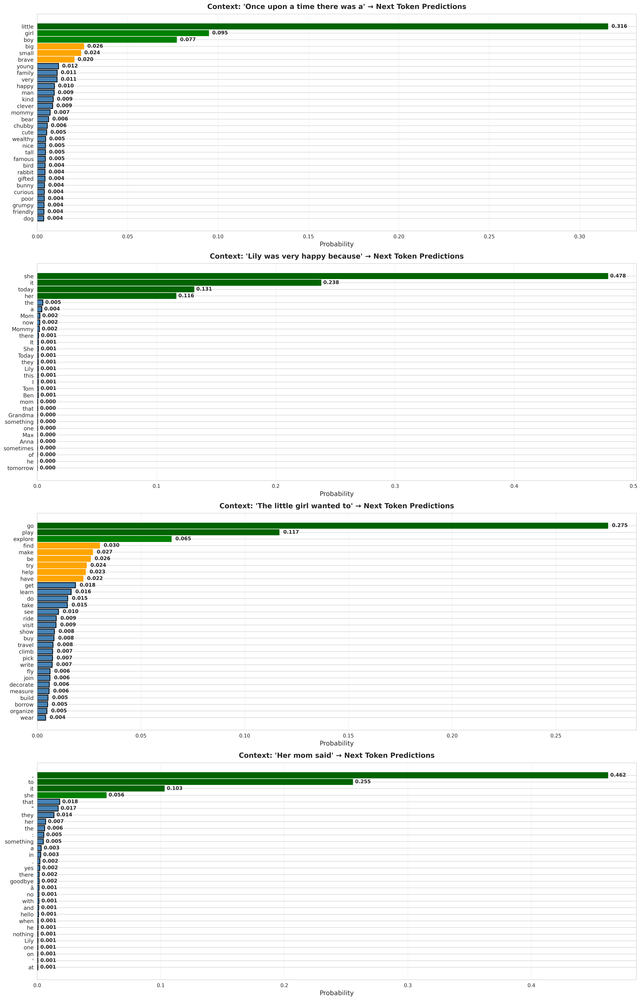
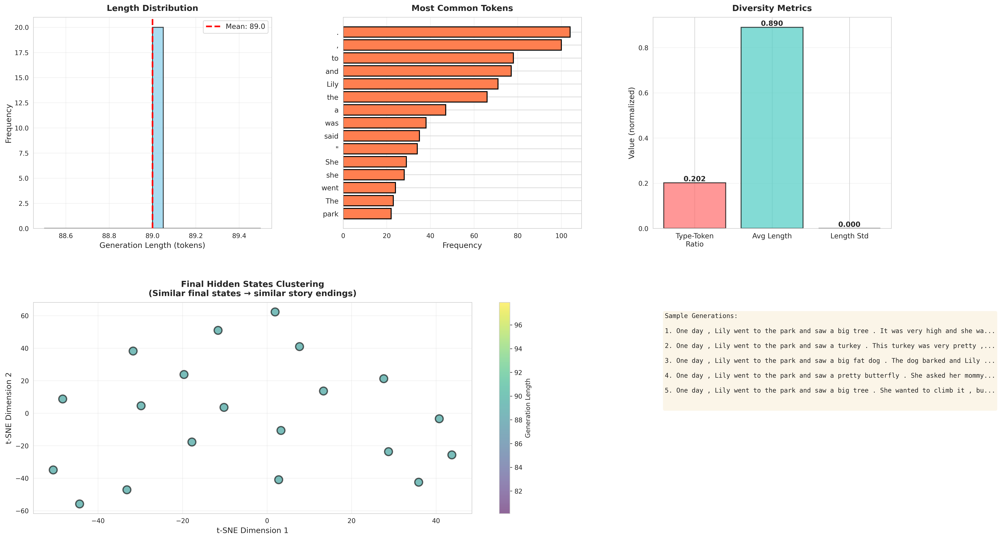

# Story GRU-LM and Interpretability

<div align="center">


_A lightweight, creative language model for generating children's stories_

[Features](#-features) • [Installation](#-installation) • [Usage](#-usage) • [Examples](#-examples) • [Training](#-training) • [Limitations](#-limitations)

</div>

---

## About

This project explores **computational creativity** through story generation. Built with a passion for understanding how machines can learn to express themselves, this GRU-based language model demonstrates that meaningful creative output doesn't always require massive transformer architectures.

### Why This Project?

- **Creative Expression**: Exploring how neural networks can capture narrative structure and generate coherent stories
- **Efficiency**: Proving that smaller, recurrent architectures can still produce engaging content
- **Learning**: Deep dive into language modeling, tokenization, and text generation techniques
- **Accessibility**: Making creative AI tools available without requiring enormous computational resources

The model was trained on the [TinyStories dataset](https://huggingface.co/datasets/roneneldan/TinyStories), a collection of simple children's stories, to learn narrative structure, character development, and story arcs.

---

## Features

- **Lightweight Architecture**: Only 93.88MB - perfect for deployment and experimentation
- **Fast Generation**: GRU-based architecture enables quick inference
- **Controllable Output**: Adjust temperature, top-k, and top-p sampling for varied creativity
- **Easy to Use**: Simple Python API for generation
- **Multi-Device Support**: Automatically detects and uses TPU/GPU/CPU
- **Post-Processing**: Built-in cleanup for common tokenization artifacts

---

## Model Architecture

```
━━━━━━━━━━━━━━━━━━━━━━━━━━━━━━━━━━
         GRU Story LM
━━━━━━━━━━━━━━━━━━━━━━━━━━━━━━━━━━
  Vocabulary Size:     4,000
  Embedding Dim:       512
  Hidden Dim:          1,024
  GRU Layers:          3
  Dropout:             0.3
  Parameters:          ~20M
  Model Size:          93.88 MB
━━━━━━━━━━━━━━━━━━━━━━━━━━━━━━━━━━
```

**Training Details:**

- **Dataset**: TinyStories (1M samples)
- **Hardware**: 2x Tesla T4 GPUs
- **Training Time**: 19 epochs
- **Best Validation Loss**: 1.585
- **Optimizer**: AdamW with Cosine Annealing
- **Tokenizer**: Byte-Pair Encoding (BPE)

---

## Installation

### Prerequisites

```bash
# Python 3.8 or higher
python --version

# Required packages
pip install torch>=2.0.0
pip install tokenizers>=0.13.0
```

### Quick Start

```bash
# Clone the repository
git clone https://github.com/yourusername/gru-story-generator.git
cd gru-story-generator

# Install dependencies
pip install -r requirements.txt

# Download the model (if not included)
# Model files: gru_story_model.pt, tokenizer.json
```

---

## Usage

### Basic Generation

```python
from inference import StoryGenerator

# Load the model
generator = StoryGenerator('gru_story_model.pt')

# Generate a story
story = generator.generate(
    prompt="Once upon a time",
    max_len=200,
    temperature=0.8
)
print(story)
```

### Advanced Options

```python
# More creative (higher temperature)
story = generator.generate(
    prompt="A brave knight",
    max_len=300,
    temperature=1.2,  # More random/creative
    top_k=50,         # Consider top 50 tokens
    top_p=0.9         # Nucleus sampling
)

# More focused (lower temperature)
story = generator.generate(
    prompt="A brave knight",
    max_len=300,
    temperature=0.5,  # More deterministic
    post_process=True # Clean up tokenization artifacts
)
```

### Interactive Mode

```python
# Launch interactive story generator
generator.interactive()

# Commands:
# - Type any prompt to generate
# - 'temp 0.7' to adjust temperature
# - 'len 200' to change max length
# - 'quit' to exit
```

---

## Examples

### Temperature Comparison

The same prompt at different temperatures shows the trade-off between coherence and creativity:

#### Temperature 0.5 (Conservative)

<details>
<summary>Click to expand</summary>

```
Prompt: "I love my cat"

I love my cat, Mittens. Mittens is very soft and cuddly. She likes
to play with her and run around the house. One day, my mom gives her
a toy to play with. It is a small red ball. The ball is red and soft.
It has a button on the back. I press the button and the ball makes a
sound. I like the sound of the ball...
```

**Characteristics:**

- ✅ More coherent and logical flow
- ✅ Consistent narrative structure
- ⚠️ Less creative, more repetitive
- ⚠️ Safer word choices

</details>

#### Temperature 0.8 (Balanced)

<details>
<summary>Click to expand</summary>

```
Prompt: "I love my cat"

I love my cat, Mimi. Mimi is a small, white kitten with soft fur and
black eyes. Mimi is very cute and soft. Mimi likes to hug Mimi and
hug her. One day, Mimi and Mimi go to the park. Mimi is hungry and
I want to eat some grass. Mimi sees a big apple and wants to eat it...
```

**Characteristics:**

- ✅ Good balance of coherence and creativity
- ✅ Introduces plot elements
- ✅ Character development
- ⚠️ Some repetition but manageable

</details>

#### Temperature 1.5 (Creative)

<details>
<summary>Click to expand</summary>

```
Prompt: "I love my cat"

I love my cat. It is a soft and fluffy cat. It is soft and fluffy.
I like to give it a name. One day, I want to give my cat a hug. He
takes my cat and hugs it. The cat is happy. It purrs and jumps around.
It has a red bow. It purrs and licks its face...
```

**Characteristics:**

- ✅ Very creative and unexpected
- ✅ Unique story directions
- ⚠️ Less coherent structure
- ⚠️ More grammatical inconsistencies
- ⚠️ Higher repetition in some areas

</details>

### Repetition Analysis

Repetition patterns vary significantly with temperature:

| Temperature | Coherence  | Creativity | Repetition | Best For             |
| ----------- | ---------- | ---------- | ---------- | -------------------- |
| 0.5         | ⭐⭐⭐⭐⭐ | ⭐⭐       | High       | Educational content  |
| 0.8         | ⭐⭐⭐⭐   | ⭐⭐⭐⭐   | Medium     | General stories      |
| 1.5         | ⭐⭐       | ⭐⭐⭐⭐⭐ | Variable   | Experimental writing |

---

## Training

### Training Your Own Model

```python
from train import train, Config

# Configure training
config = Config()
config.vocab_size = 4000
config.embed_dim = 512
config.hidden_dim = 1024
config.num_layers = 3
config.batch_size = 256
config.num_epochs = 100
config.learning_rate = 0.001

# Start training (auto-detects TPU/GPU/CPU)
train()
```

### Training on Custom Data

```python
# Option 1: Use CSV files
config.train_csv_path = "data/train.csv"
config.val_csv_path = "data/val.csv"
config.csv_text_column = "text"

# Option 2: Use custom text file
config.custom_text_file = "data/stories.txt"
config.use_tinystories = False  # Disable TinyStories

# Option 3: Mix both
config.use_tinystories = True
config.custom_text_file = "data/extra_stories.txt"
```

### Hardware Requirements

- **Minimum**: 4GB RAM, CPU (slow but works)
- **Recommended**: 8GB+ VRAM GPU (NVIDIA)
- **Optimal**: TPU or multi-GPU setup

---

## ⚠️ Limitations

### Known Issues

1. **Tokenization Artifacts**

   - Some words get split incorrectly (e.g., "David" → "D av id")
   - Post-processing helps but doesn't catch everything
   - More common with proper nouns not in training data

2. **Repetition**

   - Model can get stuck in repetitive loops, especially at high temperatures
   - Common with phrases like "The cat was..." or "She said..."
   - Increasing top-k/top-p can help reduce this

3. **Context Length**

   - Maximum sequence length: 300 tokens
   - Stories longer than this may lose coherence
   - GRU architecture limits long-term dependencies

4. **Story Quality**

   - Trained on children's stories - vocabulary and complexity are limited
   - May struggle with complex plots or adult themes
   - Sometimes generates illogical sequences

5. **Character Consistency**
   - Character names may change mid-story
   - Character actions can be inconsistent
   - Limited understanding of character continuity

### Technical Limitations

```
┌─────────────────────────────────────┐
│ Context Window: 300 tokens          │
│ Vocabulary: 4,000 tokens            │
│ Training Data: Children's stories   │
│ Architecture: GRU (not Transformer) │
└─────────────────────────────────────┘
```

### Future Improvements

- [ ] Implement beam search for better generation
- [ ] Add story structure constraints
- [ ] Fine-tune on specific genres
- [ ] Increase vocabulary size
- [ ] Add character tracking mechanism
- [ ] Implement better repetition penalty
- [ ] Explore transformer architecture

---

## Performance Metrics

### Quality Metrics

- **Validation Loss**: 1.585
- **Perplexity**: 4.88

### Result Diagrams

1. EMBEDDING SPACE VISUALIZATION

   VISUALIZING EMBEDDING SPACE

Reducing 512D embeddings to 2D using TSNE...



2.  GENERATION DYNAMICS

    GENERATION DYNAMICS VISUALIZATION

    Prompt: 'Once upon a time there was a little girl named Lily who'
    racking layer 2/2 (0-indexed) hidden states...

        Generated: loved playing with yarn . She had many yarn s , but she didn ' t have any yarn to make herself fly . One day , she decided to order a p itch named T itch . Y um ! On the day of the park , Lily found a nice , soft spot to sit and sit . She put her hand on the p itch and waited for the T itch to come out . " Would



3. TOKEN IMPORTANCE ANALYSIS

   TOKEN IMPORTANCE VISUALIZATION

   Text: 'Once upon a time there was a little girl who loved to play with her toy'

   

✓ Visualization complete!

- Heatmap shows which past tokens influence each prediction
- Bar chart shows which tokens are most influential overall

4. PREDICTION CONFIDENCE

   PREDICTION CONFIDENCE VISUALIZATION

   Analyzing: 'Once upon a time there was a'

   Analyzing: 'Lily was very happy because'

   Analyzing: 'The little girl wanted to'

   Analyzing: 'Her mom said'



5. GENERATION DIVERSITY

   GENERATION DIVERSITY ANALYSIS

Prompt: 'One day, Lily went to the park and'
Generating 20 samples...

## 

---

## Acknowledgments

- **TinyStories Dataset**: [Ronen Eldan & Yuanzhi Li](https://huggingface.co/datasets/roneneldan/TinyStories)
- **PyTorch**: For the excellent deep learning framework
- **Hugging Face**: For the Tokenizers library
- **Community**: For inspiration and feedback


---

<div align="center">

**Built with ❤️ and curiosity about computational creativity**

_"Every AI-generated story is a small step toward understanding how machines can express themselves"_

</div>
